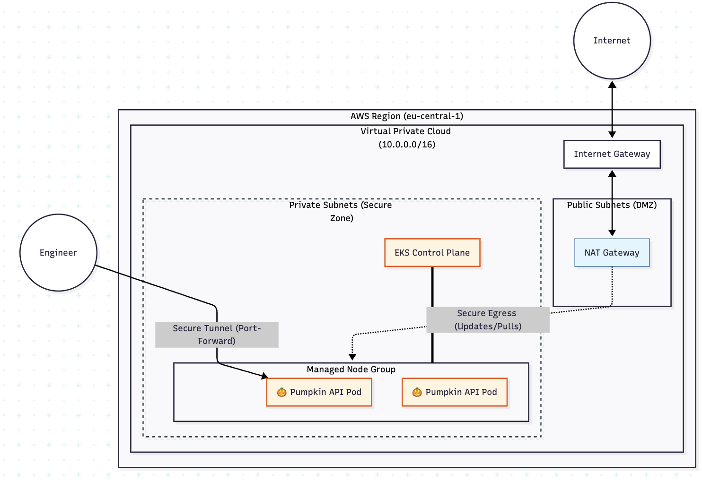

# 🎃 Global Pumpkin Insurance - Platform Foundation



## 🛡️ Architectural Decisions & Security Posture
Operating in a **regulated financial environment**, this infrastructure prioritizes the **"Zero Trust"** principle and the **Principle of Least Privilege (PoLP)**.

### 1. Network Isolation ("Data Vault" Approach)
* **Private-First EKS:** The EKS Worker Nodes are located in strictly private subnets. They have no public IP addresses and cannot be reached from the internet.
* **Controlled Egress:** Outbound traffic (for image pulls and security patches) is routed through a **NAT Gateway**, providing a single, auditable exit point.
* **No Public LoadBalancer:** To protect sensitive financial data, the Web API is not exposed to the public internet. Access is restricted to the internal network via `ClusterIP`.

### 2. Identity & Access Management (IAM)
* **Fine-Grained Roles:** Separate IAM roles were created for the Cluster Control Plane and the Node Groups, ensuring nodes only have the permissions necessary to pull images and manage networking.
* **Namespace Isolation:** The application is deployed into a dedicated `application` namespace to prevent "noisy neighbor" effects and allow for future NetworkPolicies.

### 3. Operational Readiness (The "Reproducibility" Factor)
* **Modular Terraform:** Infrastructure is split into reusable modules (`networking`, `eks`). This allows the same audited code to be used for `dev`, `staging`, and `prod` with zero drift.
* **Helm Overrides:** Deployment logic is separated from environment configuration. `values-dev.yaml` optimizes for cost (t3.mediums), while `values-prod.yaml` is architected for High Availability (HA).

---

## 🌍 Cloud Portability: AWS to Azure (AKS) Translation
As part of the design for a global company, the stack is designed to be provider-agnostic.

| Component | AWS Implementation | Azure (AKS) Equivalent |
| :--- | :--- | :--- |
| **Orchestrator** | EKS (Elastic Kubernetes Service) | AKS (Azure Kubernetes Service) |
| **Node Scaling** | Managed Node Groups (ASG) | AKS Node Pools (VMSS) |
| **Networking** | VPC with Private Subnets | VNet with Subnet Isolation |
| **Egress** | NAT Gateway + Elastic IP | Azure NAT Gateway |
| **Identity** | IAM Roles for Service Accounts | Azure Workload Identity |

---

## 🚀 Deployment & Verification

### Prerequisites
* Terraform >= 1.5.0
* Kubectl & Helm

### Step 1: Provision Infrastructure
```bash
cd terraform/environments/dev
terraform init
terraform apply
```

### Step 2: Accessing the Protected API

Since the service is strictly internal (Security Requirement), use the following secure tunnel to verify the web API:

```bash
kubectl port-forward svc/pumpkin-app 8080:80 -n application
```

Now access the API at http://localhost:8080.